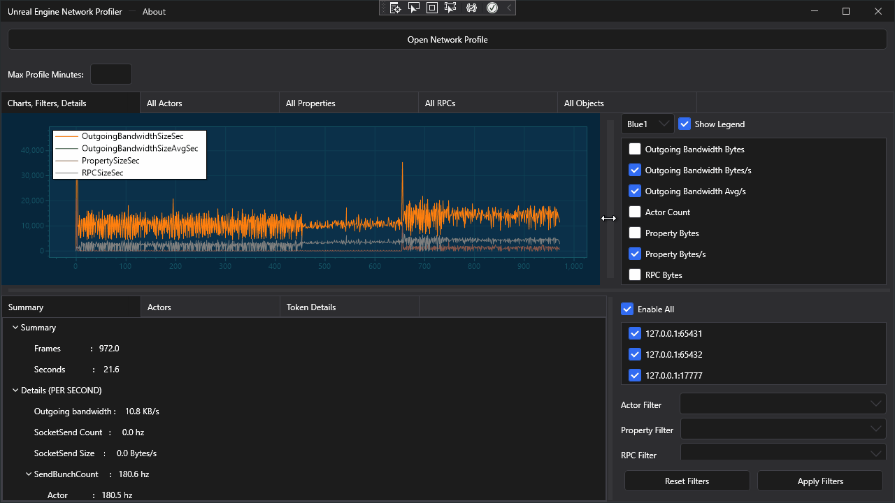

Unreal Engine Network Profiler
======================

This is a WPF rewrite of Network Profiler by Epic Games. Check out the original program at [Unreal Engine Repository](https://github.com/EpicGames/UnrealEngine/tree/master/Engine/Source/Programs/NetworkProfiler).

 
  

 

Limitations
===================

* Clicking on graph to view data for single frame is not supported.

* Selecting a range from the graph is not supported.

* List view sorting is not supported.

Dependencies
===================

[HandyControl](https://github.com/HandyOrg/HandyControl)

[ScottPlot](https://github.com/ScottPlot/ScottPlot)

[GameAnalytics](https://github.com/GameAnalytics/GA-SDK-C-SHARP)
